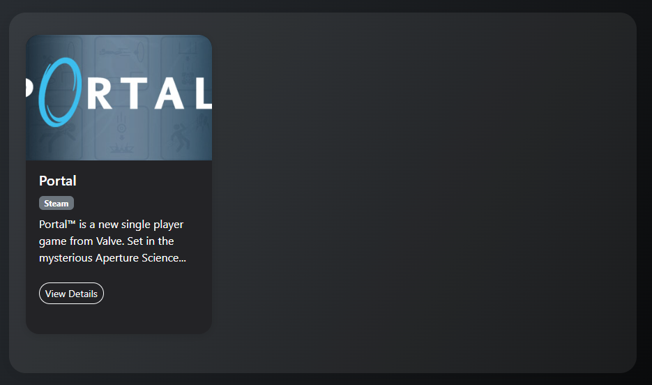
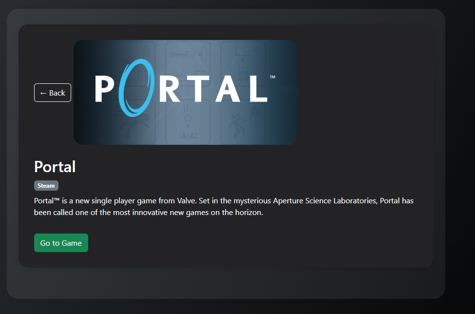

# NowFreeGames

A simple web app to browse currently free games on Steam, Epic Games Store, and GOG, powered by [api.freestuffbot.xyz](https://api.freestuffbot.xyz/).

## Preview

---

## Features

- 🕹️ Browse all currently free games from Steam, Epic, and GOG
- 🔎 Filter by platform using the navbar
- 📄 Click a game card to view details and a direct link to claim
- 💡 Responsive, mobile-friendly design

---

## How it works

- Fetches live free game offers from [api.freestuffbot.xyz](https://api.freestuffbot.xyz/)
- Uses a CORS proxy for browser compatibility (see `index.html`)
- No backend required

---

## Potential TODOs

- [ ] Remove CORS proxy and use a backend for production
- [ ] Add search and sorting options
- [ ] Show more details (expiry date, requirements, etc.)
- [ ] Add support for more stores (Amazon, Ubisoft, etc.)
- [ ] Add dark/light theme toggle
- [ ] Add PWA support for offline use
- [ ] Improve error handling and loading states

---

## How to run

1. Clone this repo
2. Open `index.html` in your browser, or use [GitHub Pages](https://pages.github.com/) for live hosting

---

## License

MIT
